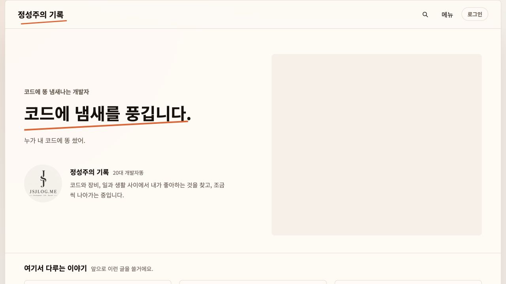
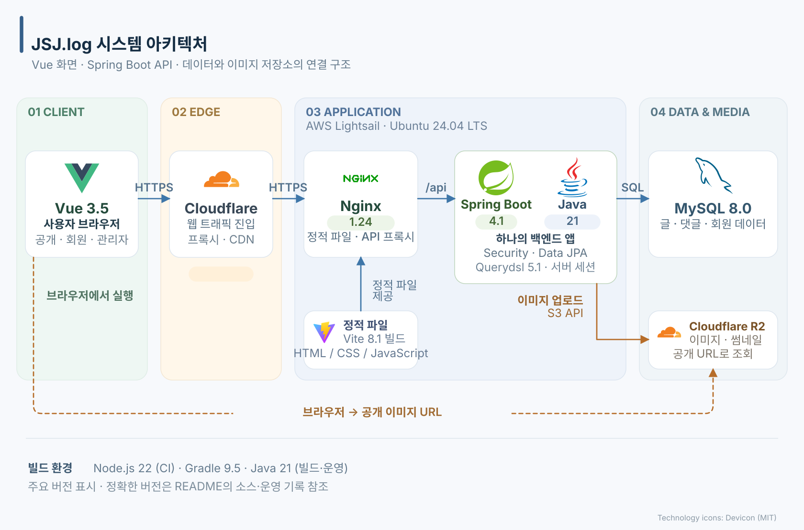
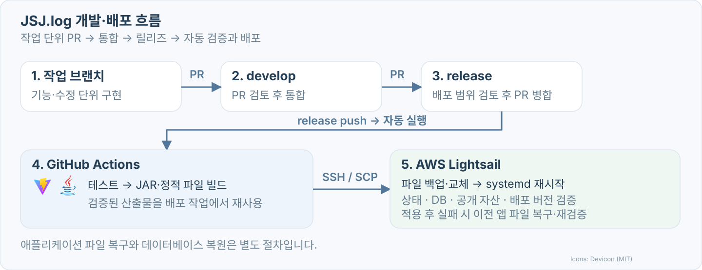

# JSJ.log
글을 쓰고, 댓글로 이야기를 나누고, 홈 화면까지 직접 관리하는 개인 블로그입니다.<br/>

[](https://jsjlog.me)

*2026년 10월 4일의 홈 화면*

[블로그 방문](https://jsjlog.me) · [주요 기능](#주요-기능) · [시스템 구조](#시스템-구조) · [로컬에서 실행하기](#로컬에서-실행하기) · [테스트와 빌드](#테스트와-빌드)

## 주요 기능

### 글, 댓글
카테고리별로 글을 둘러보거나 검색할 수 있습니다. 
글을 읽은 뒤에는 관련 글이나 이전·다음 글로 이어서 이동할 수 있습니다.

Google, Kakao, Naver 계정으로 로그인하면 댓글과 답글을 쓰고, 글이나 댓글에 반응을 남길 수 있습니다.<br/>
작성한 댓글을 모아 보거나 수정·삭제할 수 있고, 신고와 알림 기능도 제공합니다.<br/>
회원은 닉네임을 바꾸거나 탈퇴할 수 있습니다.

### 글을 쓰고 관리하기
관리자는 블록 편집기로 글을 작성하고 발행합니다.<br/> 
작성 중인 내용은 브라우저에 임시 저장하며, 글과 댓글을 수정하면 변경 이력을 남깁니다.<br/> 
발행을 취소하거나 글을 휴지통으로 옮길 수 있고, 휴지통에 있는 글은 복원할 수 있습니다.<br/>
관리자 화면에서는 글뿐 아니라 카테고리와 메뉴, 댓글, 회원, 업로드한 이미지도 관리합니다.

### 홈 화면의 내용도 관리자 화면에서
홈 화면의 문구를 고치거나 프로필 사진, 블로그 소개 등 대문에 들어가는 요소들을 변경할 때도<br/> 
관리자 화면을 사용하여 편집할 수 있도록 구성하였습니다. 

**관리자 화면에서 수정한 내용은 DB에 저장하고, 홈 화면에서 API로 다시 불러올 때 반영합니다.**<br/> 
문구나 이미지를 바꿀 때 프론트엔드를 다시 배포할 필요가 없습니다.<br/>
화면 배치와 스타일, 버튼 이름처럼 고정된 문구는 코드에서 수정합니다.

## 시스템 구조


블로그에 접속하면 Nginx가 HTML, CSS, JavaScript 파일을 보내줍니다.<br/>
이 파일은 Vite로 빌드한 결과물이며, Vue 앱은 방문자의 브라우저에서 실행됩니다.

글 목록이나 본문이 필요하면 Vue에서 API를 호출합니다.<br/>
요청은 Cloudflare와 Nginx를 거쳐 Spring Boot로 전달됩니다.<br/> 
백엔드는 요청에 필요한 권한과 입력값을 확인한 뒤 MySQL에서 데이터를 읽거나 수정합니다.<br/> 
Vue는 그 응답을 받아 화면에 보여줍니다.

이미지는 관리자가 이미지를 올리면 백엔드에서 파일을 검사하고 썸네일을 만든 뒤 R2에 저장합니다.<br/>
이후 브라우저는 이미지의 공개 URL로 직접 요청합니다.<br/>
즉 이미지와 관련된 메타데이터는 데이터베이스에, 사진 파일은 R2에 썸네일과 원본을 구분하여 저장합니다.

로그인은 Spring Security와 서버 세션을 사용합니다.<br/>
회원은 소셜 계정으로, 관리자는 아이디와 비밀번호로 로그인합니다.<br/> 
글이나 댓글을 변경하는 요청에는 CSRF 토큰도 함께 보내고,<br/> 
인가가 필요한 API요청에는 인가를 검사하는 로직이 있어 사용자와 관리자가 접근할 수 있는 api가 명확히 구분되게 됩니다.

### 사용한 기술

| 구분 | 기술과 버전 |
| --- | --- |
| 프론트엔드 | Vue 3.5 · Vue Router 4.6 · Vite 8.1 · Node.js 22 |
| 백엔드 | Java 21 · Spring Boot 4.1 · Gradle 9.5 |
| 인증과 DB 접근 | Spring Security · Spring Data JPA · Querydsl 5.1 |
| 데이터베이스 | MySQL 8.0 |
| 서버 | Nginx 1.24 · Ubuntu 24.04 LTS · AWS Lightsail |
| 프록시와 이미지 저장소 | Cloudflare · Cloudflare R2 |
| 테스트와 배포 | JUnit · Spring Boot Test · Node Test Runner · Playwright 1.63 · GitHub Actions |

라이브러리의 정확한 버전은 [package-lock.json](frontend/package-lock.json), [build.gradle](backend/build.gradle), [Gradle Wrapper 설정](backend/gradle/wrapper/gradle-wrapper.properties)에서 확인할 수 있습니다.<br/> 
CI에서 쓰는 버전은 [워크플로우 설정](.github/workflows/checks.yml)에 있습니다.

운영 서버의 패치 버전과 실제 적용된 설정은 [2026년 10월 4일 확인 기록](ops/runtime-2026-10-04.md)에 정리했습니다.

## 코드 살펴보기

프론트엔드는 `app`, `features`, `shared`로 나눴습니다.<br/>
`app`에는 앱의 시작점과 라우터를, `features`에는 글·회원·관리자 등 기능별 화면과 API 호출 코드를 둡니다.<br/> 
여러 기능에서 함께 쓰는 코드는 `shared`에 모았습니다.<br/>
공개 화면과 관리자 화면은 서로 다른 레이아웃을 쓰고, 각 페이지는 해당 경로에 접근할 때 불러옵니다.

백엔드도 글, 회원, 홈 설정처럼 기능별로 패키지를 나눴습니다.<br/>
각 패키지 안에서 Controller가 요청을 받고, Service가 처리한 뒤, Repository를 통해 데이터를 읽고 씁니다.<br/> 
DB에 저장할 데이터는 엔티티로, API로 주고받을 데이터는 DTO로 구분합니다.

```text
blog/
├── frontend/
│   ├── src/
│   │   ├── app/                 # 앱 진입점, 라우터, 페이지 메타 정보
│   │   ├── features/            # 공개 블로그·회원·관리자 기능
│   │   └── shared/              # 공통 API, UI, 콘텐츠 처리
│   └── tests/                  # 단위·브라우저 테스트
├── backend/
│   └── src/
│       ├── main/java/me/jsjlog/blog/
│       │   ├── admin/          # 관리자 API·콘텐츠 운영
│       │   ├── home/           # 대문·프로필·주제 콘텐츠 설정
│       │   ├── post/           # 글·댓글·반응
│       │   ├── member/         # 회원·계정 상태
│       │   ├── history/        # 글·댓글 변경 이력
│       │   ├── notification/   # 회원 알림
│       │   └── common/         # 인증·예외·응답·업로드 등 공통 기능
│       ├── main/resources/     # 프로필별 애플리케이션 설정
│       └── test/               # 백엔드 단위·통합 테스트
├── .github/workflows/          # PR 검사·release 배포
├── scripts/                    # 배포·복구·배포 검증 스크립트
├── examples/                   # 로컬 실행 환경변수·소셜 로그인 설정 예제
├── ops/                        # 로컬 개발·운영·데이터베이스 절차
└── assets/readme/              # 공개 화면·구조도·로고 라이선스
```

| 찾고 싶은 내용 | 관련 코드 |
| --- | --- |
| 화면과 URL 연결 | [프론트 라우터](frontend/src/app/router/index.js) |
| 기능별 화면·상태·API | [프론트 기능 모듈](frontend/src/features/) |
| 공통 API 호출·CSRF·인증 만료 처리 | [API 클라이언트](frontend/src/shared/api/blogApiClient.js) |
| 공개 글 조회 API | [PostController](backend/src/main/java/me/jsjlog/blog/post/controller/PostController.java) |
| 관리자 글 API | [AdminPostController](backend/src/main/java/me/jsjlog/blog/admin/controller/AdminPostController.java) |
| 홈 콘텐츠 관리 | [관리자 홈 설정](frontend/src/features/admin/pages/AdminHomeSettingsPage.vue) · [홈 API·도메인](backend/src/main/java/me/jsjlog/blog/home/) |
| 인증·권한 정책 | [SecurityConfig](backend/src/main/java/me/jsjlog/blog/common/config/SecurityConfig.java) |
| 이미지 저장소 설정 | [UploadConfig](backend/src/main/java/me/jsjlog/blog/common/config/UploadConfig.java) |

## 로컬에서 실행하기

JDK 21, Node.js 22, MySQL 8.0이 필요합니다.<br/> 
이미지 저장소는 로컬에서도 R2를 사용하므로 본인의 개발용 Cloudflare R2 계정과 버킷도 준비해야 합니다.

처음 실행한다면 [로컬 개발 환경 준비](ops/local-development.md)부터 따라 해 주세요.<br/> 
DB와 계정을 만드는 방법, R2 키를 발급받는 방법을 순서대로 정리했습니다.<br/>
아래 명령은 DB와 R2를 준비한 뒤 실행합니다.

### 1. 환경변수 준비

저장소 루트에서 예제 파일을 복사합니다.<br/> 
`cp -n`을 사용하므로 기존 `.env` 파일이 있으면 그대로 둡니다.

```bash
cp -n examples/backend.env.example backend/.env
chmod 600 backend/.env
```

`backend/.env`를 열어 DB 비밀번호와 R2 값을 채웁니다.<br/>
[예제 파일](examples/backend.env.example)에서 사용하는 로컬 DB 이름은 `blog_local`입니다.

### 2. 백엔드 실행

앱이 `.env`를 자동으로 읽지는 않습니다.<br/> 
같은 터미널에서 환경변수를 먼저 불러오고 백엔드를 실행합니다.

```bash
cd backend
set -a
source .env
set +a
./gradlew bootRun
```

### 3. 프론트엔드 실행

새 터미널을 열고 저장소 루트에서 실행합니다.

```bash
cd frontend
npm ci
npm run dev
```

브라우저에서 [http://localhost:5173](http://localhost:5173)을 엽니다. 
API와 로그인 요청은 [Vite 프록시](frontend/vite.config.js)를 통해 로컬 백엔드로 전달됩니다.

### 4. 실행 결과 확인

별도 터미널에서 다음 두 요청을 보내봅니다.

```bash
curl --fail http://127.0.0.1:8080/api/health
curl --fail 'http://127.0.0.1:8080/api/v1/blog/posts?size=1'
```

첫 번째 요청은 서버가 응답하는지 확인합니다.<br/> 
두 번째 요청은 DB에서 글 목록을 읽어옵니다.<br/> 
새로 만든 DB에는 글이 없으므로 빈 목록이 나와도 정상입니다.

관리자 계정은 자동으로 만들어지지 않습니다.<br/> 
관리자 화면을 사용하려면 [로컬 개발 가이드](ops/local-development.md)에 따라 계정을 준비해 주세요.<br/> 
같은 문서에 이미지 업로드 확인 방법과 Google 로그인 설정도 있습니다.<br/> 
소셜 로그인은 필요한 경우에만 추가로 설정하면 됩니다.

## 테스트와 빌드
아래 명령은 각각 저장소 루트에서 시작합니다.

### 백엔드
테스트를 실행하고 배포에 사용할 JAR 파일을 만듭니다.

```bash
cd backend
./gradlew --no-daemon clean test bootJar
```

기본 테스트는 H2를 사용합니다.<br/> 
이미지 저장소 같은 외부 서비스는 테스트용 구현으로 대신하므로,<br/> 
이 테스트를 통과해도 실제 MySQL 연결이나 R2 업로드, 소셜 로그인은 따로 확인해야 합니다.

### 프론트엔드

단위 테스트와 브라우저 테스트를 실행한 뒤 화면을 빌드합니다.

```bash
cd frontend
npm ci
npx playwright install chromium
npm test
npm run test:browser
npm run build
```

브라우저 테스트는 Vite 서버를 직접 띄우고 미리 준비한 API 응답을 사용합니다.<br/> 
개발 서버나 백엔드를 먼저 실행할 필요는 없습니다.<br/>
Linux에서 브라우저 실행에 필요한 시스템 패키지가 없다면 `npx playwright install --with-deps chromium`으로 설치합니다.

### 배포 스크립트
배포와 복구 스크립트는 다음 명령으로 테스트합니다.

```bash
python3 -m unittest discover -s scripts/tests -p '*_test.py'
```

빌드가 끝나면 백엔드 JAR는 `backend/build/libs/`에, 프론트엔드 파일은 `frontend/dist/`에 생성됩니다.<br/> 
GitHub Actions에서 실행하는 검사도 [Checks 워크플로우](.github/workflows/checks.yml)에서 확인할 수 있습니다.

## 개발하고 배포하기



처음에는 개발 서버와 운영 서버를 나누고 개발 서버에 배포 -> 테스트 진행 완료 -> 운영서버 배포 구조로 설계 하였으나,<br/>
여러명이 개발하면 해당 방식으로 진행하려고 하였으나, 혼자 개발 중이기도 하고, 서버를 증설하는 비용이 부담되어 브랜치 구조만 두고<br/>
개발 과정에서는 개발서버 배포 -> 운영 서버로 배포하고 운영서버에서 테스트 중입니다.<br/>
추후 블로그 규모가 커지거나, 운영에 바로 올리는 것이 리스크라 판단되면 개발서버를 구축할 예정입니다.

작업은 기능이나 수정 사항별로 따게된 브랜치에서 시작합니다.<br/>
구현과 테스트를 마치면 `develop`으로 PR을 보내 검토하고 병합하게 되고,<br/>
배포할 때는 다시 `develop`에서 `release`로 PR을 열어 변경 내용을 확인합니다.<br/>


`release`에 병합되면 GitHub Actions가 테스트와 빌드를 실행합니다.<br/>
여기서 만든 JAR와 프론트엔드 파일을 Lightsail에 배포하고, systemd로 백엔드를 다시 시작합니다.<br/> 
Nginx는 배포된 프론트엔드 파일을 제공합니다.

배포 후에는 상태 API뿐 아니라 DB 조회, 공개 페이지와 앱 파일, 배포 버전도 확인합니다.<br/> 
파일을 교체한 뒤 검증에 실패하면 이전 앱 파일로 복구하고 다시 검사합니다.<br/> 
이때 DB까지 이전 상태로 돌아가는 것은 아닙니다.<br/> 
DB 복원이 필요한 경우에는 별도 절차를 따라야 합니다.

서버 접속과 복구 방법은 [운영 안내](ops/README.md)에, DB 변경과 복원 방법은 [DB 운영 안내](ops/database/README.md)에 정리했습니다.

## 운영 시 DB, 접속 정보 관리
**관리자 로그인은 마지막 활동으로부터 2시간 동안 유지합니다.** <br/>
일반 회원의 세션과는 별도로 적용하는 기준입니다.

**현재 DB 설정은 빠른 개발을 위해 `ddl-auto=update`입니다.** <br/>
실제 운영시에는  DDL로 각 테이블을 생성하고, ddl-auto를 validate로 변경하는 것을 권장합니다.<br/>
테이블 별 핵심이 되는 컬럼들이 앞에 오는 게 아니라, (user_id, post_id 등 ) <br/>
테이블 마다 공통적으로 들어오는 컬럼들이 먼저 보여서, (created_by, updated_by 등)
DDL을 다시 작성하여 밀어넣을 예정입니다.

구체적인 순서는 [DB 운영 안내](ops/database/README.md)에 있습니다.<br/>

비밀번호와 접근 키, 토큰, 실제 서버 접속 정보는 저장소에 넣지 않습니다.<br/>
실행 환경과 GitHub Secrets에서 관리합니다.

## 라이선스

프로젝트 라이선스는 아직 정하지 않았습니다.<br/> 
코드의 재사용과 배포 조건도 함께 정할 예정입니다.<br/>
구조도에 사용한 로고는 [Devicon](https://github.com/devicons/devicon)에서 가져왔으며, [MIT 라이선스](assets/readme/DEVICON-LICENSE.txt)가 적용됩니다.<br/> 
이는 로고에 대한 라이선스이며 프로젝트 코드의 라이선스와는 별개입니다.
